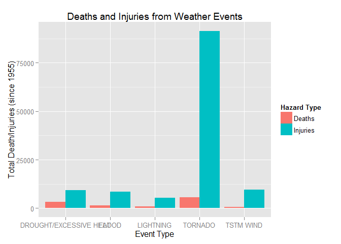
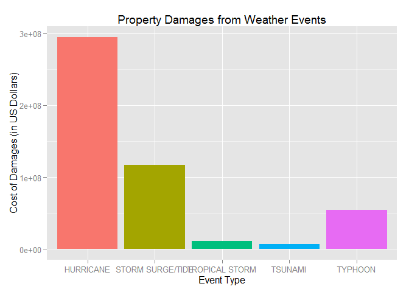
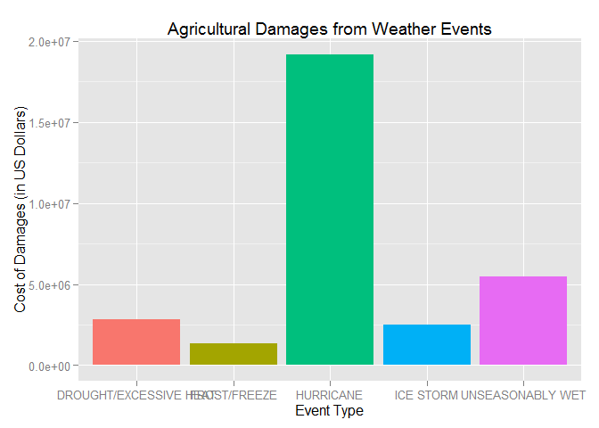

# Evaluating Consequences of Storm Events
Jesus Dacuma  
October 25, 2015  

## Synopsis

Weather data from the NOAA Storm Database was analyzed for overall effects to the US population and agriculture. The goal was to find which weather events are most harmful with respect to population health, and which weather events have the greatest economic consequences. Results found that tornadoes are the most hazardous and cause more deaths and injuries than any other event. Additionally, hurricanes are the most costly events, and they rank highest in both property and agricultural damage.

## Data Processing
Storm data can be downloaded from the NOAA Storm Database. The `dplyr` library is used to convert the data frame to a tbl_df.

```r
download.file("http://d396qusza40orc.cloudfront.net/repdata%2Fdata%2FStormData.csv.bz2", 
              "StormData.csv.bz2",
              method = "curl")
stormData <- read.csv("StormData.csv.bz2")
```


```r
library(dplyr)
storm.tbl <- tbl_df(stormData)
```

The loaded dataset contains 902297 rows, and since the data contains events since 1955, there are many inconsistencies with the entries. To correctly evaluate the consequences of weather events, the first step is to clean up the dataset. 

### Cleaning Event Types (EVTYPE)

The raw data contains more than 900 levels of events, but many of these are the same and just vary in terminology (FROST vs. FREEZE), abbreviations (TSTM vs. THUNDERSTORM), case (RAIN vs. Rain), typos and other.

The process used to clean the data set was dynamic that involved looking at the most common event types (`head(storm.tbl %>% count(EVTYPE, sort = TRUE), 20)`) and searching for similar event names using regular expressions (`unique(storm.tbl$EVTYPE[grep("event", storm.tbl$EVTYPE, ignore.case = TRUE)])`). 


```r
# Combine similar names of event types
storm.tbl$EVTYPE[grep("TSTM", storm.tbl$EVTYPE, ignore.case = TRUE)] <- "TSTM WIND"
storm.tbl$EVTYPE[grep("THUNDER", storm.tbl$EVTYPE, ignore.case = TRUE)] <- "TSTM WIND"
storm.tbl$EVTYPE[grep("HAIL", storm.tbl$EVTYPE, ignore.case = TRUE)] <- "HAIL"
storm.tbl$EVTYPE[grep("TORNADO", storm.tbl$EVTYPE, ignore.case = TRUE)] <- "TORNADO"
storm.tbl$EVTYPE[grep("FLOOD", storm.tbl$EVTYPE, ignore.case = TRUE)] <- "FLOOD"
storm.tbl$EVTYPE[grep("HIGH WIND", storm.tbl$EVTYPE, ignore.case = TRUE)] <- "HIGH WIND"
storm.tbl$EVTYPE[grep("SNOW", storm.tbl$EVTYPE, ignore.case = TRUE)] <- "SNOW"
storm.tbl$EVTYPE[grep("RAIN", storm.tbl$EVTYPE, ignore.case = TRUE)] <- "RAIN"
storm.tbl$EVTYPE[grep("LIGHTNING", storm.tbl$EVTYPE, ignore.case = TRUE)] <- "LIGHTNING"
storm.tbl$EVTYPE[grep("WINTER", storm.tbl$EVTYPE, ignore.case = TRUE)] <- "WINTER STORM"
storm.tbl$EVTYPE[grep("SPOUT", storm.tbl$EVTYPE, ignore.case = TRUE)] <- "WATERSPOUT"
storm.tbl$EVTYPE[grep("FUNNEL", storm.tbl$EVTYPE, ignore.case = TRUE)] <- "FUNNEL CLOUD"
storm.tbl$EVTYPE[grep("CLOUD", storm.tbl$EVTYPE, ignore.case = TRUE)] <- "FUNNEL CLOUD"
storm.tbl$EVTYPE[grep("STRONG WIND", storm.tbl$EVTYPE, ignore.case = TRUE)] <- "STRONG WIND"
storm.tbl$EVTYPE[grep("URBAN", storm.tbl$EVTYPE, ignore.case = TRUE)] <- "URBAN/SML STREAM FLD"
storm.tbl$EVTYPE[grep("STREAM", storm.tbl$EVTYPE, ignore.case = TRUE)] <- "URBAN/SML STREAM FLD"
storm.tbl$EVTYPE[grep("FROST", storm.tbl$EVTYPE, ignore.case = TRUE)] <- "FROST/FREEZE"
storm.tbl$EVTYPE[grep("FREEZE", storm.tbl$EVTYPE, ignore.case = TRUE)] <- "FROST/FREEZE"
storm.tbl$EVTYPE[grep("FIRE", storm.tbl$EVTYPE, ignore.case = TRUE)] <- "WILDFIRE"
storm.tbl$EVTYPE[grep("BLIZZARD", storm.tbl$EVTYPE, ignore.case = TRUE)] <- "BLIZZARD"
storm.tbl$EVTYPE[grep("MICROBURST", storm.tbl$EVTYPE, ignore.case = TRUE)] <- "MICROBURST"
storm.tbl$EVTYPE[grep("DROUGHT", storm.tbl$EVTYPE, ignore.case = TRUE)] <- "DROUGHT/EXCESSIVE HEAT"
storm.tbl$EVTYPE[grep("HEAT", storm.tbl$EVTYPE, ignore.case = TRUE)] <- "DROUGHT/EXCESSIVE HEAT"
storm.tbl$EVTYPE[grep("DRY", storm.tbl$EVTYPE, ignore.case = TRUE)] <- "DROUGHT/EXCESSIVE HEAT"
storm.tbl$EVTYPE[grep("WET", storm.tbl$EVTYPE, ignore.case = TRUE)] <- "UNSEASONABLY WET"
storm.tbl$EVTYPE[grep("COLD", storm.tbl$EVTYPE, ignore.case = TRUE)] <- "EXTREME COLD/WIND CHILL"
storm.tbl$EVTYPE[grep("CHILL", storm.tbl$EVTYPE, ignore.case = TRUE)] <- "EXTREME COLD/WIND CHILL"
storm.tbl$EVTYPE[grep("ICE STORM", storm.tbl$EVTYPE, ignore.case = TRUE)] <- "ICE STORM"
storm.tbl$EVTYPE[grep("FOG", storm.tbl$EVTYPE, ignore.case = TRUE)] <- "DENSE FOG"
storm.tbl$EVTYPE[grep("SURF", storm.tbl$EVTYPE, ignore.case = TRUE)] <- "RIP CURRENTS/HEAVY SURF"
storm.tbl$EVTYPE[grep("CURRENT", storm.tbl$EVTYPE, ignore.case = TRUE)] <- "RIP CURRENTS/HEAVY SURF"
storm.tbl$EVTYPE[grep("HURRICANE", storm.tbl$EVTYPE, ignore.case = TRUE)] <- "HURRICANE"
storm.tbl$EVTYPE[grep("TROPICAL STORM", storm.tbl$EVTYPE, ignore.case = TRUE)] <- "TROPICAL STORM"
storm.tbl$EVTYPE[grep("SLIDE", storm.tbl$EVTYPE, ignore.case = TRUE)] <- "MUDSLIDE"
storm.tbl$EVTYPE[grep("SLUMP", storm.tbl$EVTYPE, ignore.case = TRUE)] <- "LANDSLUMP"
storm.tbl$EVTYPE[grep("DUST", storm.tbl$EVTYPE, ignore.case = TRUE)] <- "DUST STORM"
storm.tbl$EVTYPE[grep("AVALANC", storm.tbl$EVTYPE, ignore.case = TRUE)] <- "AVALANCHE"
storm.tbl$EVTYPE[grep("SURGE", storm.tbl$EVTYPE, ignore.case = TRUE)] <- "STORM SURGE/TIDE"
storm.tbl$EVTYPE[grep("WAVE", storm.tbl$EVTYPE, ignore.case = TRUE)] <- "ROGUE WAVE"
storm.tbl$EVTYPE[grep("EROS", storm.tbl$EVTYPE, ignore.case = TRUE)] <- "BEACH EROSION"
```

The above code does not clean the entire dataset. However, the goal was to clean enough of the dataset to make a representative portion reliable.


```r
# Calculate percentage of cleaned rows
cleanRate <- sum(head(storm.tbl %>% count(EVTYPE, sort = TRUE), 25)$n) / nrow(storm.tbl)

head(storm.tbl %>% count(EVTYPE, sort = TRUE), 20)
```

```
## Source: local data frame [20 x 2]
## 
##                     EVTYPE      n
## 1                TSTM WIND 336818
## 2                     HAIL 289283
## 3                    FLOOD  82724
## 4                  TORNADO  60699
## 5                HIGH WIND  21950
## 6             WINTER STORM  19597
## 7                     SNOW  17682
## 8                LIGHTNING  15761
## 9                     RAIN  12165
## 10            FUNNEL CLOUD   6997
## 11  DROUGHT/EXCESSIVE HEAT   5246
## 12                WILDFIRE   4239
## 13              WATERSPOUT   3851
## 14             STRONG WIND   3824
## 15    URBAN/SML STREAM FLD   3414
## 16                BLIZZARD   2726
## 17 EXTREME COLD/WIND CHILL   2685
## 18               ICE STORM   2008
## 19               DENSE FOG   1882
## 20 RIP CURRENTS/HEAVY SURF   1838
```

At least the top 25 most common events were categorized correctly, so at the very least, 99.66 percent of the dataset has a correct event type.

### Cleaning Magnitudes of Property and Agricultural Damages (PROPDMGEXP and CROPDMGEXP)

Cost of damages was unconventionally recorded in the dataset. The damage is recorded as a value (`PROPDMG` and `CROPDMG`) with a magnitude multiplier (`PROPDMGEXP` and `CROPDMGEXP`). While each event had a double stored as a value of damage cost, the magitudes were inconsistent, varying from alphabetical (K, M, B), to numeric (4, 5, 6, etc.), to symbolic (+, -, ?) to missing. 

The magnitudes were standardized as numerical powers of 10, and a singular value for each event was calculated and stored in the dataset.


```r
# All events with $0 in damages have magnitude of zero
storm.tbl$PROPDMGEXP[storm.tbl$PROPDMG==0] <- 0

# Change magnitudes from alphabetical to numeric
storm.tbl$PROPDMGEXP <- tolower(as.character(storm.tbl$PROPDMGEXP))
storm.tbl$PROPDMGEXP[storm.tbl$PROPDMGEXP=="h"] <- 2
storm.tbl$PROPDMGEXP[storm.tbl$PROPDMGEXP=="k"] <- 3
storm.tbl$PROPDMGEXP[storm.tbl$PROPDMGEXP=="m"] <- 6
storm.tbl$PROPDMGEXP[storm.tbl$PROPDMGEXP=="b"] <- 9
storm.tbl$PROPDMGEXP[storm.tbl$PROPDMGEXP==""] <- NA
storm.tbl$PROPDMGEXP[storm.tbl$PROPDMGEXP=="+"] <- NA
storm.tbl$PROPDMGEXP[storm.tbl$PROPDMGEXP=="-"] <- NA
storm.tbl$PROPDMGEXP <- as.numeric(storm.tbl$PROPDMGEXP)

# Calculate property damage costs
storm.tbl$PROPDMGCOST <- storm.tbl$PROPDMG * 10 ^ storm.tbl$PROPDMGEXP

missingProp <- nrow(storm.tbl[is.na(storm.tbl$PROPDMGCOST),])
```

Much of the inconsistencies were solved as the some events did not have an monetary impact (`PROPDMG = 0`), and processing the data only left 82 rows with missing data on property damages. With a large dataset of 902297 rows, the missing rows leave minimal impact.

Data for agricultural damages was cleaned in similar fashion. 


```r
# All events with $0 in damages have magnitude of zero
storm.tbl$CROPDMGEXP[storm.tbl$CROPDMG==0] <- 0

# Change magnitudes from alphabetical to numeric
storm.tbl$CROPDMGEXP <- tolower(as.character(storm.tbl$CROPDMGEXP))
storm.tbl$CROPDMGEXP[storm.tbl$CROPDMGEXP=="k"] <- 3
storm.tbl$CROPDMGEXP[storm.tbl$CROPDMGEXP=="m"] <- 6
storm.tbl$CROPDMGEXP[storm.tbl$CROPDMGEXP=="b"] <- 9
storm.tbl$CROPDMGEXP[storm.tbl$CROPDMGEXP==""] <- NA
storm.tbl$CROPDMGEXP <- as.numeric(storm.tbl$CROPDMGEXP)

# Calculate agricultural damage costs
storm.tbl$CROPDMGCOST <- storm.tbl$CROPDMG * 10 ^ storm.tbl$CROPDMGEXP

missingCrop <- nrow(storm.tbl[is.na(storm.tbl$CROPDMGCOST),])
```

Again, only 3 rows had missing values, which is an insignificant amount. Any rows with missing damage values can be omitted from analysis.

## Results

### Effects on Population Health

For analysis of population health effects from each event, the total number of deaths and injuries was calculated for each type of weather event. The data arranged in descending order of deaths; however, it is interesting to note that the weather events with the five highest death totals also have the five highest injury totals (although not in the same order).


```r
# Calculate total deaths/injuries
popHealthTot <- storm.tbl %>% group_by(EVTYPE) %>% 
    summarize(Deaths = sum(FATALITIES), Injuries = sum(INJURIES)) %>% 
    arrange(desc(Deaths), desc(Injuries))

popHealthTot
```

```
## Source: local data frame [263 x 3]
## 
##                     EVTYPE Deaths Injuries
## 1                  TORNADO   5636    91407
## 2   DROUGHT/EXCESSIVE HEAT   3167     9229
## 3                    FLOOD   1525     8604
## 4                LIGHTNING    817     5231
## 5                TSTM WIND    756     9545
## 6  RIP CURRENTS/HEAVY SURF    738      775
## 7  EXTREME COLD/WIND CHILL    453      321
## 8                HIGH WIND    299     1523
## 9             WINTER STORM    277     1876
## 10               AVALANCHE    225      170
## ..                     ...    ...      ...
```

The weather events most hazardous to population health are shown above, and the top five include tornadoes, droughts and excessive heat, floods, lightning, and thunderstorm wind.

The plot below shows a visual comparison of the effects from the five most hazardous weather events. Tornadoes rank highest in both deaths and injuries since 1955, and the amount of injuries caused by tornadoes dwarfs the number injuries from any other event.


```r
library(reshape2)
popMelt <- melt(head(popHealthTot, 5), "EVTYPE")

library(ggplot2)
g1 <- ggplot(data=popMelt, aes(x=EVTYPE, y=value, fill=variable)) +
    geom_bar(stat="identity", position=position_dodge()) +
    labs(title = "Deaths and Injuries from Weather Events",
         x = "Event Type", y = "Total Death/Injuries (since 1955)") +
    scale_fill_discrete(name="Hazard Type")

g1
```

 

### Economic Effects

Financial consequences can differ according to the type of event. Changes in temperature from droughts or extreme cold can damage crops, while other events of a more physical nature such as tornadoes and mudslides can damage property. Some events have are so extreme, they have the ability to do both (storms, floods, wildfires).

Damages to property and agriculture were calculated separately, as mitigating the effects of these damages can differ. Events were ranked according to the average cost in damages, so one can use the results to estimate how much money a specific event may cost.


```r
stormPropCost <- storm.tbl %>% filter(!is.na(PROPDMGCOST)) %>% 
    group_by(EVTYPE) %>% summarize(PROPAVGCOST = mean(PROPDMGCOST)) %>%
    arrange(desc(PROPAVGCOST))

stormPropCost
```

```
## Source: local data frame [263 x 2]
## 
##              EVTYPE PROPAVGCOST
## 1         HURRICANE 294969268.3
## 2  STORM SURGE/TIDE 116703708.0
## 3           TYPHOON  54566363.6
## 4    TROPICAL STORM  11067992.2
## 5           TSUNAMI   7203100.0
## 6             FLOOD   2034072.5
## 7          WILDFIRE   2004394.6
## 8         ICE STORM   1964854.5
## 9           TORNADO    939145.6
## 10         MUDSLIDE    505922.8
## ..              ...         ...
```

```r
g2 <- ggplot(data = head(stormPropCost, 5), aes(x=EVTYPE, y=PROPAVGCOST, fill=EVTYPE)) + 
    geom_bar(stat = "identity") + guides(fill=FALSE) + 
    labs(title = "Property Damages from Weather Events",
         x = "Event Type", y = "Cost of Damages (in US Dollars)")

g2
```

 

The events costing the most money in property damages are hurricanes, storm surges, typhoons, tropical storms and tsunamis. Hurricanes and storm surges are especially damaging, as they are the only events to cause over 100 million dollars in property damages, with hurricanes causing just under 300 million dollars in damages.

One thing to note is that the five most costly weather events really break down into two categories: major storms (hurricanes, typhoons and tropical storms) and immense coastal waves (storm surges and tsunamis). For the purposes of city planning, one can plan similarly for these types of events.


```r
stormCropCost <- storm.tbl %>% filter(!is.na(CROPDMGCOST)) %>% 
    group_by(EVTYPE) %>% summarize(CROPAVGCOST = mean(CROPDMGCOST)) %>% 
    arrange(desc(CROPAVGCOST))

stormCropCost
```

```
## Source: local data frame [263 x 2]
## 
##                     EVTYPE CROPAVGCOST
## 1                HURRICANE 19182204.88
## 2         UNSEASONABLY WET  5461538.46
## 3   DROUGHT/EXCESSIVE HEAT  2835881.68
## 4                ICE STORM  2501052.54
## 5             FROST/FREEZE  1320807.54
## 6           TROPICAL STORM   996981.35
## 7  EXTREME COLD/WIND CHILL   506802.79
## 8                    FLOOD   149655.23
## 9                 WILDFIRE    95136.03
## 10                 TYPHOON    75000.00
## ..                     ...         ...
```

The events costing the most money in agricultural damage are hurricanes, unseasonable wetness, droughts and excessive heat, and frost. Hurricanes cause approximately 19 million dollars in damages to crops, while the other four are in the range of one to five million dollars.


```r
g3 <- ggplot(data = head(stormCropCost, 5), aes(x=EVTYPE, y=CROPAVGCOST, fill=EVTYPE)) + 
    geom_bar(stat = "identity") + guides(fill=FALSE) + 
    labs(title = "Agricultural Damages from Weather Events",
         x = "Event Type", y = "Cost of Damages (in US Dollars)")

g3
```

 

The table below shows the total costs from both property and agricultural damage. However, the total cost is very heavily influenced by property damages.

Hurricanes cause the most in damages as it was the only event to rank in the top five in both property and agricultural damage.


```r
stormTotCost <- stormPropCost %>% inner_join(stormCropCost, by = "EVTYPE") %>%
    mutate(TOTAVGCOST = PROPAVGCOST + CROPAVGCOST) %>% 
    arrange(desc(TOTAVGCOST))

stormTotCost
```

```
## Source: local data frame [263 x 4]
## 
##                    EVTYPE PROPAVGCOST  CROPAVGCOST TOTAVGCOST
## 1               HURRICANE 294969268.3 19182204.878  314151473
## 2        STORM SURGE/TIDE 116703708.0     2080.292  116705788
## 3                 TYPHOON  54566363.6    75000.000   54641364
## 4          TROPICAL STORM  11067992.2   996981.349   12064974
## 5                 TSUNAMI   7203100.0     1000.000    7204100
## 6        UNSEASONABLY WET         0.0  5461538.462    5461538
## 7               ICE STORM   1964854.5  2501052.540    4465907
## 8  DROUGHT/EXCESSIVE HEAT    203284.7  2835881.677    3039166
## 9                   FLOOD   2034072.5   149655.228    2183728
## 10               WILDFIRE   2004394.6    95136.030    2099531
## ..                    ...         ...          ...        ...
```

## Conclusion

Weather events can have damaging effects toward population health, property damage and agricultural damage. The most hazardous events to the population are tornadoes, causing more deaths and injuries than any other type of event. Storms and high waves cause the most property damage, while extreme conditions resulting in either excessive wetness or dryness cause the most agricultural damage. Hurricanes cause the most damage to either property or crops and are by far the most costly weather event.
